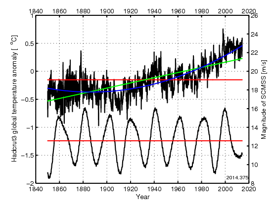

# Magnitude-Squared-Coherence-for-Climate-Data

This is Matlab code for producing the figures for

* S. Holm, "On the alleged coherence between the global temperature and the sun's movement," J. Atmos. Solar-Terrestr. Phys., April 2014
* S. Holm, "Prudence in estimating coherence between planetary, solar and climate oscillations" Astrophys. Space Sci., May 2015

The most unique aspect of this code is that it provides a way of finding confidence intervals for magnitude squared coherence estimators which are based on only a few averages, even when the data sets have near line spectra. The main code for accomplishing that can be found in the calls to ebisuzaki.m, mscohere, and randomPhaseMSC.m.

The code will produce Figs. 1-9 in "Prudence in estimating coherence between planetary, solar and climate oscillations", Astrophys Space Sci, 2015, except the 95% confidence interval in Fig 5, since that builds on software from a third party (Stepan Poluianov). These Matlab figures all have numbers starting with 2015.

Figure 2 is shown here:

The code will also generate Figs. 1-5 and the data for Table 1 in "On the alleged coherence between the global temperature and the sun's movement", Journ Atmospher. Solar Terr. Physics, 2014 (including the Corrigendum), except the 95% confidence intervals in Figs. 4 and 5, since that builds on software from a third party (ShouYan Wang). These Matlab figures all have numbers starting with 2014.

Open the zip-file and extract it in a separate directory. These sub-directories will then be created:
* 'data' - for the HadCRUT3 global temperature dataset and solar data from the JPL HORIZONS on-line solar system data and ephemeris computation service.
* 'timeutil' - for time and date utilities by Peter John Acklam.
* 'weaclim' - for two routines (ebisuzaki.m and stan.m) from the Weaclim toolbox by Vincent Moron.
* 'WaveletCoherence' - for the Cross wavelet and wavelet coherence toolbox by Aslak Grinsted. These are the only files that are not included in the download. If you don't want to download and install this toolbox yourself, you may comment out the final 50 or so lines of the prudence.m program. Figures 4 and 5 of the 2015 paper then won't be generated.
Run the program by typing 'prudence' at the Matlab prompt. Then select whether you want the 2015 or the 2014 sets of figures to be generated. In the first case you will also be prompted to respond to whether you want a fast and inaccurate simulation of confidence intervals (nsim=10) for Figs. 6-8 or a slow, but accurate simulation (nsim=1000) as used in the paper.

The code requires the Matlab Signal Processing Toolbox from Mathworks for functions like mscohere, kaiser, and pburg. It runs on Matlab R2013b which seems to be the last version which supports the version of the Cross wavelet and wavelet coherence toolbox that I used.

Other sources:
* [HadCRUT3 dataset](https://www.metoffice.gov.uk/hadobs/hadcrut3/)
* [JPL Horizons on-line solar system data and ephemeris computation service](https://ssd.jpl.nasa.gov/horizons/)
* [WEACLIM](https://se.mathworks.com/matlabcentral/fileexchange/10881-weaclim) by Vincent Moron
* Time and date utilities by Peter John Acklam
* Aslak Grinsted's [Cross wavelet and wavelet coherence toolbox](http://grinsted.github.io/wavelet-coherence/)

For the context of these two papers see [Climate Data Oscillations and the Magnitude Squared Coherence](https://www.mn.uio.no/fysikk/english/people/aca/sverre/climate.html)
